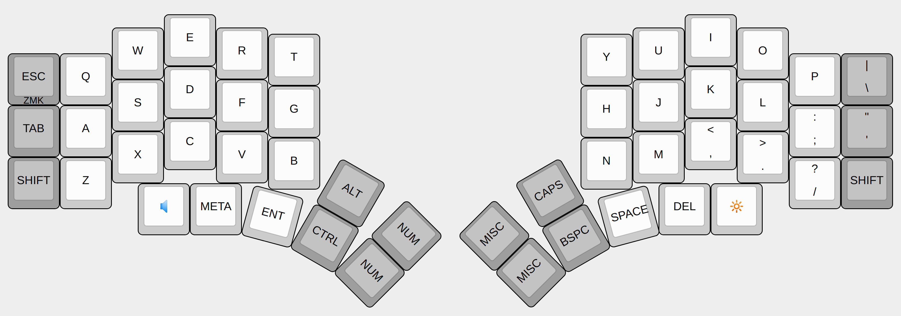
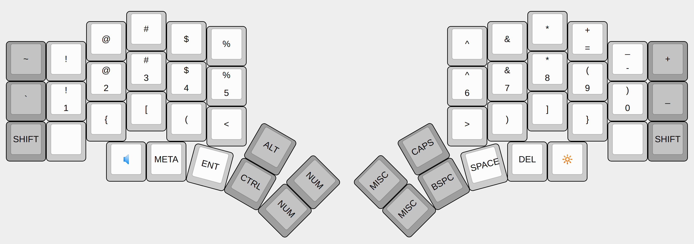
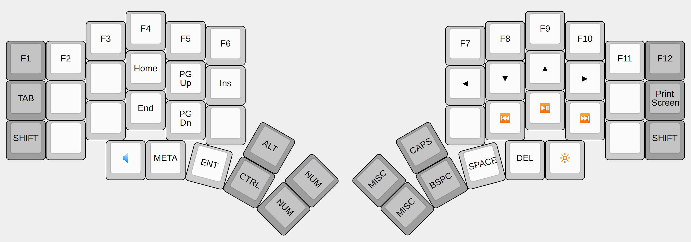
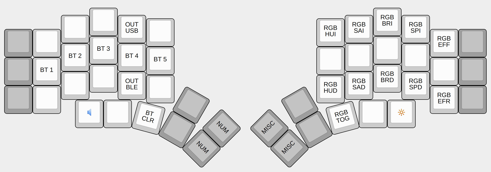

# Kyria configuration for ZMK and QMK

>The images were generated in http://www.keyboard-layout-editor.com/ with the corresponding json files.

Default Layer

Numer Layer

Miscellaneous Layer

ZMK Control Layer
